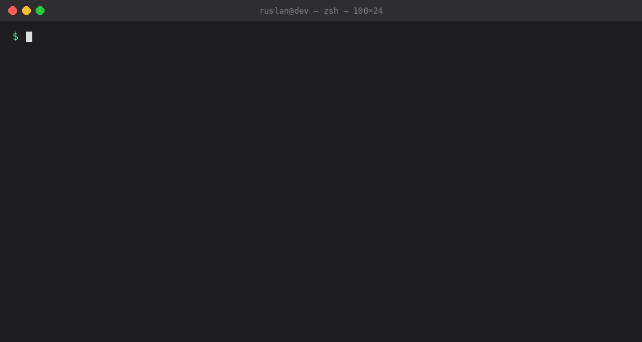

# AGENTS.md in the Wild

**480 real agent instruction files from 272 production repositories — stored in full, refreshed weekly, with the patterns measured instead of guessed.**


Everyone writing an `AGENTS.md` is guessing. The format has no spec worth the name, the advice online is one person's blog post repeated forty times, and the actual files that steer agents in React, Grafana, LangChain and Home Assistant are scattered across a thousand repositories where nobody reads them side by side.

This is the side-by-side. Not a link list — **the files themselves**, in one tree, greppable.



```bash
git clone https://github.com/sattva2020/agents-md-in-the-wild
grep -rl "never" agents-md-in-the-wild/corpus/*/AGENTS.md | head
```

That is the whole interface. Clone it, grep it, steal the good parts.

---

## Contents

- [What is in here](#what-is-in-here)
- [What the corpus says](#what-the-corpus-says)
- [Layout](#layout)
- [Two storage tiers, and why](#two-storage-tiers-and-why)
- [Running it yourself](#running-it-yourself)
- [FAQ](#faq)
- [Contributing](#contributing)

---

## What is in here

| | |
|---|---:|
| Repositories | **272** |
| Instruction files | **480** |
| Stored in full | **441** |
| Median stars of source repo | **50 123** |
| Sources above 50k stars | **136** |

Filenames covered:

| Filename | Files |
|---|---:|
| `AGENTS.md` | 208 |
| `CLAUDE.md` | 194 |
| `.github/copilot-instructions.md` | 57 |
| `GEMINI.md` | 12 |
| `.cursorrules` | 9 |

Sources include React, Grafana, LangChain, Home Assistant, Hugo, Ollama, Transformers, AutoGPT, VS Code, Next.js, PowerToys and 140+ others.

## What the corpus says

Measured across the 441 fully stored files. Full report with method: **[PATTERNS.md](PATTERNS.md)** — regenerated on every refresh, never hand-edited.

| Element | Share of files |
|---|---:|
| Explicit prohibitions (*do not / never / must not*) | 68% |
| How to run tests | 54% |
| Architecture or layout overview | 50% |
| Build / run commands | 44% |
| Contrastive examples (good vs bad) | 41% |
| Code style rules | 41% |
| Points at other files (`@refs` or links) | 37% |
| Commit / PR conventions | 32% |
| Emphatic markers (IMPORTANT / CRITICAL) | 23% |
| Security or secrets guidance | 21% |
| Directory tree block | 17% |

Median file: **92 lines, 647 words**. Longest in the corpus: 1 494 lines.

Three things worth noticing. Prohibitions are the single most common element — more common than telling the agent how to *build the project*. Only 21% say anything about secrets, in files that routinely hand an agent the run of the repository. And the median is 92 lines, which is a long way from the 500-line documents people argue about online.

## Layout

```
corpus/
  <owner>__<repo>/
    AGENTS.md        # verbatim copy
    CLAUDE.md
    meta.json        # source URL, commit SHA, stars, licence, tier
data/
  index.json         # every entry with per-file signals
  index.csv          # same, flattened for spreadsheets
PATTERNS.md          # generated analysis
scripts/             # collector, analyser, licence detector — stdlib only
```

Every `meta.json` carries the upstream permalink and the blob SHA the copy was taken at, so any file here can be traced back and diffed against its source.

## Two storage tiers, and why

This repository redistributes other people's files. That is fine under permissive and copyleft licences with attribution, and it is **not** fine for a repository that ships no licence at all — where the default is all rights reserved.

So there are two tiers:

- **`full`** — 251 repositories. Licence is on the [redistribution allowlist](scripts/policy.py); the file is stored verbatim with source, commit SHA and licence recorded.
- **`metadata`** — 21 repositories. No redistributable licence upstream, so only *structure* is stored: headings, counts, and a link. No body text.

Licences are read from the upstream `LICENSE` file and identified by text fingerprint ([`scripts/licenses.py`](scripts/licenses.py)), because the GitHub search API frequently omits licence metadata. Anything unrecognised stays unlicensed and drops to metadata tier — ambiguity always resolves to *do not store*.

If you maintain one of these repositories and want your file out, open an issue and it goes immediately, no discussion.

## Running it yourself

No dependencies. Nothing to install.

```bash
python scripts/collect.py --limit 200 --min-stars 5000   # discover and fetch
python scripts/analyze.py                                # rebuild index + PATTERNS.md
```

Collect specific repositories:

```bash
python scripts/collect.py --targets vercel/next.js grafana/grafana
```

<details>
<summary>How discovery works</summary>

Two strategies feed the same writer:

- **code-search** — direct hits via the code search API, sliced by file size to work around the 1000-result cap. Precise, needs a token.
- **repo-sweep** — walks popular repositories by language and star band, probing each for the target filenames. Slower, but finds files code search misses and works when code search is unavailable.

The writer is idempotent: re-running only rewrites files whose upstream blob SHA changed, which is what makes the weekly diff readable instead of a wall of noise. When the REST API is unavailable or the token is repository-scoped, the client falls back to `raw.githubusercontent.com` and hashes content itself to keep change detection working.

</details>

<details>
<summary>How the pattern signals are defined</summary>

Each signal is a narrow predicate in [`scripts/analyze.py`](scripts/analyze.py). Narrow on purpose: the first version of the directory-tree detector matched any bullet containing a slash and reported 69%. Hand-checking a sample showed a 60% false-positive rate. The corrected detector requires a run of three consecutive tree-shaped lines and excludes markdown tables — the real figure is 17%.

That is the standard every signal here is held to. If you find one that inflates, open an issue with the counter-example and it gets fixed.

</details>

## FAQ

**Is this just another awesome list?**
No. Awesome lists are link collections; the links rot and you cannot grep them. This stores the files, records where each came from, and regenerates its own analysis. The nearest link-list equivalents sit at 26, 70 and 438 stars — none of them store files and none of them cover `AGENTS.md`.

**How current is it?**
The refresh workflow runs every Monday and commits only when upstream files actually changed. Check the [Actions tab](https://github.com/sattva2020/agents-md-in-the-wild/actions) for the last run.

**Why include `CLAUDE.md`, `GEMINI.md` and Copilot instructions?**
Because the interesting question is what people write to steer agents, and that question does not respect vendor boundaries. The same repository often ships two of them with different content — which is itself a finding.

**Can I use this to train something?**
The `full` tier is redistributable under each source's licence, which is recorded per entry in `meta.json`. Check it. The corpus is not licensed as a whole and cannot be — the files belong to their authors.

**My repository is in here and I would rather it were not.**
Open an issue. It is removed the same day, no questions.

## Contributing

Missing a repository worth including? Open an issue with the URL, or run `python scripts/collect.py --targets owner/repo` and send the result as a PR. Found a pattern signal that misfires? A counter-example is the most useful thing you can send — see [CONTRIBUTING.md](CONTRIBUTING.md).

If this saved you an hour of reading other people's repositories, **star it** — it is how the next person finds it.

---

Code in `scripts/` is MIT. Files in `corpus/` belong to their original authors under their own licences, recorded per entry.
